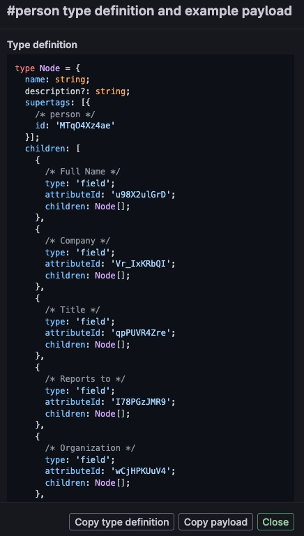

# Webhook support

Based on the inspiring example from @houshuang (see [recording](https://share.cleanshot.com/PNDJjGp4)), `tana-helper` now provides a powerful form of webhook processing.

Basically, you can shovel any text, email, etc at the `/webhook/<tana_type>` endpoint and it will process it into JSON using OpenAI and push the resulting JSON into Tana via the [Tana Input API](https://help.tana.inc/tana-input-api.html).

So you can call this webhook from pretty much any integration platform such as Zapier or for email, use the [cloudmailin.com](https://cloudmailin.com) service as @houshuang did.

## How to create a webhook endpoint without code!

To create a new webhook endpoint, all you need to do is upload the Tana supertag schema to `tana-helper` via the `/schema/<tana_type>` endpoint. You get the supertag schema by opening the supertag configuration panel in Tana and then using cmd-K to `Show API Schema`. 

Click the `Copy type definition` button and then upload it as the BODY of a POST request to `/schema/<type_name>` (Talend API tester is a handy Chrome extension for doing these kind of things)

Or you can paste it into the web configuration UI exposed by `tana-helper` which I have not built yet. :-)

## Authorization

Tana's API requires you to create and use and API Token on all calls to Tana. `tana-helper` needs you to either configure this API Token in the .env file associated with your installation as TANA-API_TOKEN. (Copy `env.template` to `.env` and then edit)

Or, you can pass it on every `/webhook/<type>` call as the `X-Tana-API-Token` header.

The webhook also has to call OpenAI. So you can configure that as OPENAI_API_KEY in the .env file or you can pass that on every webhook call as the `X-OpenAI-API-Key` header.

If you forget to configure or pass these tokens, you'll get a helpful 500 response with an error message suggesting you set the keys.

## Running this locally 

Yes, you can run this locally and still have the webhook endpoint be visible on the internet. The best way I know to do this is with the `ngrok` tool. Basically, sign up at [ngrok.com](https:ngrok.com) and then follow the install instructions. It's pretty easy. You can then forward your local service port number (using, say, `ngrok http 8000`) and you'll get an internet visible https:// URL to use. (e.g. https://XXX-YY-ZZ.ngrok-free.app). Use this in your webhook caller configuration. You'll also need to add another header so that ngrok doesn't spit back a warning on every API call. `ngrok-skip-browser-warning: anything` will work.

## Running this on a hosted server
Since this webhook needs to be accessible from the public internet, you will either have to open a tunnel using something like `ngrok` so that the world can reach your laptop OR you will need to run this on a hosted server somewhere.

Right now there is experimental support for hosting on [Deta Space](https://deta.space). It's very experimental: most of the time, OpenAI takes more than 20 seconds to respond so the service times out. :-(

If you want to try it...

Create a Deta Space account, following the setup instructions to install their `space` tool and then do a `space push` to start `tana-helper` running on your own private cloud. Once running, you should be able to configure the environment secrets for OpenAI and Tana via their web console. Click the `...` button on the app icon and then choose `Settings`. That will give you a panel for Configuration (where you put TANA_API_TOKEN and OPENAI_API_TOKEN) and for API Keys - which is the Data Space Authorization key.

You will need to create an API Key through their console. You will need to pass that API Key with every API call (webhook) as the `X-Space-App-Key` header.

Yup, it's headers all the way down...

NOTE: Deta Space will lose all your uploaded schema templates whenever you redeploy or restart the service. Working on that...
